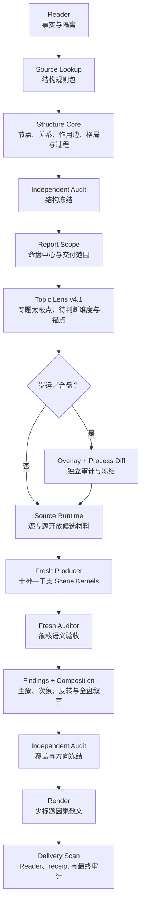

# Bazi Structure Dynamics

一套面向 Codex 的四柱八字多 skill 流水线。它把“盘面结构算对”与“现实人生断开”分成不同阶段：先冻结事实、旺衰承载、格局、作用边和制化过程，再用完整十神链与天干、地支、藏干、柱位合成现实场景，最后才写成读者报告。

当前版本：**2.0.0-rc.1**

> 这是 2.0 架构的预发布版。结构、取象、审计和 Render 合同已经落地；复杂象核启用了干净上下文 producer／auditor 隔离。正式 2.0.0 仍需更多全新命例的前向盲测。

## 它要解决什么

常见的 AI 八字解读容易落入两种失败：

- 只报身强身弱、格局、喜忌和十神标签，技术词很多，却没有断出学习层级、职业性质、权责、收入、关系角色、变动与代价；
- 直接从一个十神或一个干支写性格和职业故事，语言很像断盘，但中间没有可追溯的结构链。

本项目要求每条重要判断能回答：

1. 哪条冻结的五行过程正在运行；
2. 哪些十神在当前专题中分别扮演体、用、竞争者或结果端；
3. 天干如何形成显性动作，地支如何限定场景和根基，藏干在哪一层参与，柱位把它落到谁与什么事；
4. 这个组合更支持什么现实结果，较不支持什么；
5. 优势如何成事，代价落在哪里，需要什么现实门槛，何时会反转；
6. 哪些只是候选载体，哪些已达到可下结论的强度。

目标不是让报告更长，而是让“为什么这样断”与“现实中到底是什么”同时清楚。

## 快速开始

1. 克隆本仓库。
2. 把 `skill/` 下八个目录全部复制到 Codex 的个人 skills 目录。
3. 重启 Codex，然后从总入口调用：

```text
Use $bazi-structure-dynamics to run a detailed natal reading for this chart.
Freeze and audit natal structure before imagery, timing, or render.
```

中文也可以：

```text
用 $bazi-structure-dynamics 完整分析这个八字。先盲跑并冻结原局结构，
再做家庭、学业、财运、事业和我选择的专题；争议点用校准问题处理。
```

不要只安装总入口。八个 sibling skills 互相路由，缺任意一个都会造成流程断档。

### 输入至少需要什么

完整原局至少需要年月日时四柱。若要校验真太阳时、月令司令、大运起运或具体应期，还需要出生地、历法／节气来源和起运资料。已有报告可以作为待审对象，但默认先隔离，不作为结构答案源。

## 交付模式

| 模式 | 交付内容 | 不会冒充什么 |
|---|---|---|
| `full-reading` / `detailed-natal` | 原局八章、家庭、学业、财运、事业、全部加选专题及约定岁运 | 不用几个专题拼成“完整原局” |
| `structure-only` | 事实、旺衰、格局、节点、关系、作用边、主问题、路线、用神与过程冻结 | 不称为完整断盘 |
| `limited-topic` | 只生产约定专题的 Lens、象核、finding 和报告 | 明确列出未覆盖范围 |
| timing / synastry | 在已冻结 natal 上做临时 overlay、process diff、保留量与到期撤销 | 不把流运或对方回写为原局永久结构 |

`detailed-natal` 默认包含原局八章：

1. 事实与边界；
2. 系统发动机；
3. 四柱分工；
4. 藏干显化；
5. 关系网络；
6. 十神功能；
7. 格局、用神与能动性；
8. 整体张力。

随后才进入家庭、学业、财运、事业，以及感情、健康、神秘学／直觉、创作、人际、子女或自定义专题。用户要求逐年时，每一年必须有独立关系枚举、overlay diff、process diff、finding 与正文，不以大运综述代替。

## 流水线



### 1. 事实不能和判断混在一起

Reader 只校验四柱、日主、十神、藏干、月令、司令来源、旬空和时间边界。它不判断旺衰、格局、用神或事件；命主经历、旧报告和已知答案进入隔离区。

### 2. 结构按位置、容量和竞争计算

Structure Core 先为每个天干和每枚藏干建独立节点，再完整枚举天干关系、六合、六冲、刑、自刑、害、破、三合、半合、方会、重复支和共享支。地支裁决必须写回每个节点，作用边只能从关系后状态建立。

它分开：

- 库存与实际吞吐；
- 根气支持、环境供给与直接做功；
- 主问题、实际通量、净作用与治疗优先级；
- 日主承载、客观产出、社会兑现和持续代价；
- 系统能自行运转与命主能启动、改道、停止。

因此“有印”“有食神”“五行齐全”或“图上成环”都不能自动变成学历、职业或吉凶结论。

### 3. Structure Freeze 是断盘起点

独立审计通过后才生成 Structure Freeze。下游只能引用冻结节点、作用边、路线、用神太极核和 `structure-process-handoff`。任何方向性修改都必须重新派生并传播，不能只改最终一句话。

### 4. Topic Lens 负责“这一题到底要断什么”

Topic Lens v4.1 不预写答案。它为每个专题登记：

- 专题太极点与完整 coverage facets；
- 必须分别下方向结论的维度；
- 冻结 process、完整十神链计划；
- 天干、地支、藏干和柱位锚点；
- 开放的现实载体候选池；
- 只有用户真正问过的问题才建立 Reader Answer Contract。

内部覆盖维度不是问卷，也不会被 Render 机械写成“问题一、问题二”。

### 5. 象核不是十神标签扩写

Imagery Composition 固定执行：

```text
spread → intersect → differentiate → rank → synthesize
```

- `spread`：把相关 process、十神、干支、藏干、柱位和 runtime units 全部摊开；
- `intersect`：寻找它们实际交会的关系链；
- `differentiate`：把学历、专业技术、权责、名声、收入、变动和代价等不同结果端拆开；
- `rank`：比较支持强度和现实载体，不把候选直接升格为身份；
- `synthesize`：再把已经分清的主张合成一个连续现实画面。

单个十神或单个干支没有独立直断权。L5 具体身份需要高门槛，但 L1–L3 已有组合支持时，也不得因为不敢断具体职业而退回性格测试或空泛流程描述。

### 6. 复杂象核必须隔离生产与审计

2.0 RC 新增强制 Agent 隔离协议。以下情况命中任一项，就不能由总 session 直接写象核：

- 完整报告或复杂专题；
- timing／synastry；
- L4 现实载体竞争；
- 批量 scene kernels；
- 当前上下文已知命主经历、预期答案或用户纠错。

总编排只生成不含答案的 job packet；全新上下文 producer 每次只处理一个 topic；另一个全新上下文 auditor 独立验收。环境没有可创建干净 agent 的能力时，复杂象核停止并标记 `AGENT_ISOLATION_UNAVAILABLE`，不会让已被答案污染的主 session 代写。

详细协议见 [`scene-kernel-agent-protocol.md`](skill/bazi-imagery-composition/references/scene-kernel-agent-protocol.md)。

### 7. Composition 和 Render 分权

Composition 保存完整判断：过程、关系链、现实画面、优势、代价、兑现门、反转、替代解释和 claim strength。Render 只做语言性综合：

- 先立主场景，再沿十神链和干支组合展开；
- 使用少量有意义的标题，不按 artifact、facet 或 judgment 列目录；
- 可以把多个已分清的结果写进连续散文，但不能丢掉任一已冻结方向；
- 不打开 Deep Card、Source manifest 或原始 runtime packet；
- 材料不足时登记 render gap，退回上游，不能现场补断。

这保证报告近似人类断盘散文，同时保留后台可追溯性。

## 八个 skills 的职责

| Skill | 只负责什么 |
|---|---|
| `bazi-structure-dynamics` | 总编排、阶段恢复、硬门槛和完成标准 |
| `bazi-reader` | 排盘事实、司令与十神校验、时间边界和经历隔离 |
| `bazi-source-lookup` | 原典规则、Deep Cards、逐专题 runtime units 与开放载体材料 |
| `bazi-structure-core` | 节点、地支裁决、作用边、旺衰承载、格局、路线、用神与过程 diff |
| `bazi-topic-lens` | 专题太极点、coverage、必须判断维度、十神链和干支锚点；不下结论 |
| `bazi-imagery-composition` | scene kernels、领域 findings、跨专题 composition 与显化映射 |
| `bazi-finding-audit` | 独立审计结构、象核、finding、composition、render、岁运和交付 |
| `bazi-render` | 范围入口、审计后散文、Reader、receipt、低负担反馈和受约束追问 |

## 关键产物与审计门

| 层 | 代表产物 | 通过标准 |
|---|---|---|
| Reader | `chart-stage1`、fact audit、`subject-context` | 四柱事实和时间边界闭合，经历隔离 |
| Structure | node／branch ledgers、edge map、routes、use kernel、process handoff | 全节点覆盖、关系全枚举、端点一致、过程四面裁决 |
| Scope / Lens | `report-scope`、natal-core index、per-topic Lens | 交付范围完整，无预写答案，无维度静默合并 |
| Imagery | runtime packets、material disposition、scene kernels、findings | selected units 全量处置，十神链与干支柱位合成，方向可证伪 |
| Composition | process spine、claim registry、coverage receipt、composition | 判断不被压平，跨专题复用可追溯 |
| Render | `reader/`、full reading、render receipts | judgment／coverage／年份唯一覆盖，正文无新结论 |
| Delivery | independent scan、audit state、active manifest | 生产者自报 PASS 不算证据，独立审计无开放 BLOCKER |

机械 validator 只证明集合、引用、路径和 schema 闭合；它不能替代语义审计。字数、标题数、字段齐全或 finding 数都不能自动代表“断开了”。

## 校准、经历与盲测

- 普通经历合参只生成 `manifestation-map`，标记 `non-evidentiary`；它能调整同一结构主要落在哪个现实载体，不能回写 natal。
- 默认反馈是“准／部分准／不准／记不清”，不自动追问，也不计作证据。
- 只有用户主动要求展开验证，才在读取相关年史前冻结 timing hypotheses，随后按原话和固定 rubric 计分。
- 已经知道命主经历、错误方向或期望答案的 session 只能做故障复现和回归修复，不能冒充 blind first pass。
- 真正的前向盲测必须使用未讨论的新命例、全新 producer、独立 auditor，并在第一次输出冻结后才解封 known facts。

## 来源与可移植性

仓库内保留原典路由、公开整理文本和部分转录。未随仓库分发的外部材料使用稳定的 `external-source://...` ID，而不是维护者电脑上的绝对路径；使用者可在自己的 Source Lookup 环境中把这些 ID 映射到合法取得的本地来源。

Deep Cards 是取象候选材料，不是结构规则，也没有单符号直达职业、疾病或事件的权限。其他术数的材料只允许保留可回接阴阳五行、季节与形态的共同符号层，不能把另一体系的专属规则带入八字裁决。

出生资料、`subject-context`、命例报告、盲测答案、本机绝对路径和私有课程原文件不应提交。`.gitignore` 已覆盖常见私有产物，但发布前仍应做独立敏感信息扫描。

权利与来源说明见 [NOTICE](NOTICE.md)。仓库目前没有统一开源许可证；除非文件另有许可，不应假定可以复制、再发布或商用全部内容。

## 验证

每个 skill 都应先运行 Codex `skill-creator` 的 `quick_validate.py`。随后按修改范围运行各 skill `scripts/` 中的确定性测试，包括但不限于：

- Reader 事实与地支关系枚举；
- route endpoint、process handoff 和 freeze hash；
- Topic Lens、runtime diversity、carrier resolution；
- scene-kernel selected-unit 集合等值、材料处置和 agent provenance；
- finding／judgment／coverage closure；
- Render coverage、Reader 同文、delivery artifacts 与 independent scan。

发布前还应检查：无 `__pycache__`／`.pyc`、无命例目录、无本机盘符、无 thread ID、无 known facts、无测试答案硬编码。

## 从 1.2.0 升级

2.0 RC 不是只增加几个字段：

- Topic Lens 升为 v4.1，旧的“一题一答”或通用宽题包不能直接复用；
- Structure 必须提供完整 process handoff，下游不能只读 use kernel；
- Scene Kernel 必须重建 selected-unit disposition 和 agent provenance；
- 完整／复杂象核需要 fresh producer + independent auditor；
- Render 必须从新 composition 和 coverage receipts 重建，不能续写 1.2 报告；
- `pending_kico_review` 等维护者专名状态已迁移为 `pending_human_review` 等角色化状态；
- 外部来源绝对路径改为 `external-source://` ID。

旧 case artifacts 应归档为 inactive，再从新版 scope、Lens、runtime、scene kernels、composition 和 Render 重建。不要把旧 findings 改名后继续使用。

## 已知限制

- 2.0.0-rc.1 已实现新隔离与语义门，但尚未宣称完成足量全新命例的无提示前向盲测。
- 没有 sub-agent／fresh-context 能力的环境可以运行 Reader、Structure 和部分简单限定专题；命中复杂象核隔离门时会停止。
- Validator 能发现集合、引用和协议错误，不能证明命理判断为客观事实。
- 本项目用于传统命理文本研究和结构化分析，不构成医疗、法律、财务或其他专业建议。

完整变更见 [CHANGELOG](CHANGELOG.md)。
