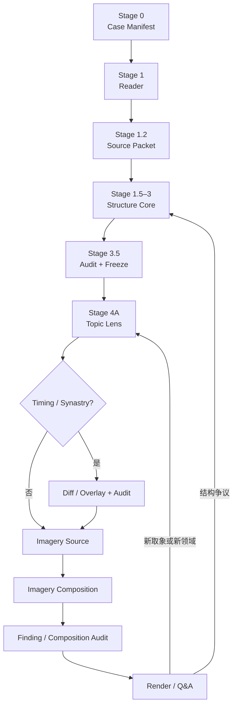

# Bazi Structure Dynamics

一套以结构动力、原典证据和阶段审计分析四柱八字的 Codex skills。

它不要求模型在一次生成里同时完成排盘校验、旺衰、格局、刑冲合害、通关、取象和成文。相反，它把分析拆成八个职责独立的 skill，每一阶段产生可检查的中间产物；下游只能引用已经通过审计的上游结论。

当前版本：**1.0.0**

## 为什么要拆成流水线

八字判断的困难不只在于规则多，而在于很多规则会争夺同一个字：

- 同一藏干既可能提供根气，也可能参与制化，但两种作用不是同一层；
- 同一个寅可能参与方会、三合、冲刑与食神路线，不能被每条路线重复满额使用；
- 五行有箭头不等于通关，图上成环也不等于真实周流；
- 实际通量最大的路线，可能正在加重主问题，而不是救应；
- 系统能够自行运转，不等于日主能够主动启动、停止或改道；
- 已发生经历能校准显化方式，却不能倒推格局或替代原典规则。

单次长回答很容易漏掉其中一层，然后在后文用贴切故事掩盖结构缺口。1.0.0 的核心变化，就是把这些判断变成必须逐阶段完成、能够退回修复的工作流。

## 总体架构



### 阶段与硬门槛

| 阶段 | 负责 skill | 主要产物 | 不能跳过的门槛 |
|---|---|---|---|
| 0 | `bazi-structure-dynamics` | `case-manifest` | 明确问题、模式、流派和允许范围 |
| 1 | `bazi-reader` | `chart-stage1`、事实审计、`subject-context` | 四柱、十神、藏干、司令、旬空与时间边界通过校验 |
| 1.2 | `bazi-source-lookup` | `source-packet` | 记录实际读取的完整章节、来源身份、冲突与证据缺口 |
| 1.5 | `bazi-structure-core` | `node-ledger`、`interaction-census` | 所有天干和逐位置藏干覆盖 100%，关系先枚举后裁决 |
| 2 | `bazi-structure-core` | 地支关系专表、`branch-state`、关系后节点、`qualified-edge-map`、系统与主问题 | 地支竞争已写回每个节点；作用边只能从关系后状态起算 |
| 3 | `bazi-structure-core` | 格局候选、路线、端点锁、条件矩阵、`structure-kernel` | 通量、净作用和治疗优先级分开；路线端点与 Edge Map 一致 |
| 3.5 | `bazi-finding-audit` | 审计报告、`structure-freeze-receipt` | BLOCKER 必须返工；通过 hash 冻结结构 |
| 4 | `bazi-topic-lens`、`bazi-source-lookup` | Topic Lens、完整取象包 | 只映射冻结结构，不在取象阶段重算旺衰和格局 |
| 4.5–5.5 | `bazi-imagery-composition`、`bazi-finding-audit` | 逐柱复合、topic findings、校准图、composition | 同柱互染不伪造作用边；经历只校准已有分支 |
| 6–6.5 | `bazi-render`、`bazi-finding-audit` | 报告或对话回答 | Render 不得新增 finding；新问题按类型退回上游 |

## Structure Core 具体做什么

Structure Core 是 1.0.0 的核心。它不是“算完旺衰再套格局”，而是依次建立一张有位置、有容量和有条件的网络。

### 1. Node Ledger：先保留每个位置

四个天干和每一枚藏干分别建账。两个寅中的甲、两个午中的丁不能先合并，因为它们的柱位、距离、冲合、根型和可作用对象不同。

每个节点记录得令、根气、透藏、受生、受克泄耗、旬空、燥湿、关系候选、当前占用及最强反证。这个阶段只说明“有什么”，不抢先宣布哪条路线已经成立。

### 2. Interaction Census：关系必须全枚举

先检查天干生克合、同柱干支、六合、六冲、刑、自刑、害、破、三合、半合、方会、重复支、共享支和藏干候选关系。没有命中的类别也保留 negative scan，防止模型只看到最醒目的一个合局。

### 3. Branch Arbitration：地支关系必须改写成员

地支关系不能停留在“有辰戌冲”或“有寅午戌”。每组关系都要裁定：

- 形式成立度与实际通量；
- 合绊、集中、改道、冲动、受损或转化；
- 共享支被多条关系占用时的容量限制；
- 每个成员支和逐枚藏干的关系后状态；
- 旬空降低兑现度与“冲不自动开库”两个独立问题；
- 原局潜伏与岁运补齐后的不同状态。

裁决结果写入 `post-branch-node-ledger`。没有被关系改变的节点也要明确标记 retained，而不是从账上消失。

### 4. Edge Qualification：有关系不等于能起效

作用边只能从关系后节点建立，并区分：

- `direct-action`：能够直接参与生克制化；
- `root-support`：提供根气或承载；
- `environmental-feed`：维持某个接收端的环境供给；
- `branch-relation`：由地支关系产生的集中、合绊或改道；
- `composition-only`：只用于取象组合，不能倒灌为结构作用。

每条边检查上游容量、距离、先后、中间阻断、下游承接、竞争路线和回病旁路。由此避免“有根就是畅通”“同支藏干自动互生”“被冲就全部出库”等常见跳步。

### 5. System State：旺衰只是系统的一项

节点和边稳定后，才聚合五行与十神库存、真实吞吐、蓄积点、最弱环、日主承载力、启动权、控制权、停机能力、自治子系统和正负反馈。

因此“身弱”不会自动抹掉已经发生的食神制杀，“五行齐全”也不会自动得到闭环。系统可以有一条很响的木火土通道，同时金水救援仍然低通量。

### 6. Primary Problem：先锁病，再谈药

在比较用神、救应和出口前，单独生成 `problem-state`，列出主问题、次问题、非问题、维持主问题的反馈、最强反证与改判条件。

之后每条路线必须回答它对这个主问题究竟是：

- 缓解；
- 加重；
- 混合；
- 只提供条件；
- 或者与本题无关。

这一步防止把“最强通道”误叫成“最佳用神”。

### 7. Structured Routes：端点锁定，路线不许手改

格局与制化路线只能引用 `qualified-edge-map` 中已经存在的 edge ID。每条路线分别记录：

- actual throughput：原局实际能跑多少；
- net effect：对主问题的净作用；
- therapeutic priority：若要解决主问题，理论上优先补哪一段；
- 最弱环、代价、旁路、反馈和触发条件。

例如食神制杀与食神生财再生杀可以同时存在，但必须说明它们争夺的是哪一枚甲木、各自能分到多少，以及哪条会把药重新导回病处。

### 8. Conditions、Kernel 与 Freeze

`conditions-matrix` 保存每条路线的成立先后、必要条件、反转节点及岁运接口；它不是预测本身。`structure-kernel` 只收束主组织、有效支援、瓶颈、出口、反馈、控制权和关键开关。

独立审计通过后，`structure-freeze-receipt` 对结构输入生成 hash。后续职业、关系、健康、神秘学、岁运和合盘只能引用这份冻结结构；任何结构文件改变，都必须重新审计。

## 取象、事实校准与对话

结构回答“什么力量能够怎样运行”，取象回答“它在当前领域可能表现成什么”。两层不得互相替代。

- `bazi-topic-lens` 先确定本题需要哪些柱、节点、路线和完整象义单元；
- `bazi-source-lookup` 读取完整展开版本，不用一句口诀补故事；
- `bazi-imagery-composition` 组合天干本象、地支本象、十神功能、柱位、藏干和全局修正；
- `bazi-finding-audit` 检查反向表现、非显化条件、现实载体和证据边界；
- `bazi-render` 只把通过审计的 findings 写成人能读懂的报告。

用户经历在盲结构与盲 finding 通过后才进入 calibration。它可以提高某个表达分支的置信度，不能修改 node、edge、route 或格局。

对话追问也有路由：

- 已有 finding 的澄清：直接 Render；
- 同一结构的新取象：增量 Source + Imagery；
- 新生活领域：新 Topic Lens；
- 新流年／大运：Timing diff；
- 合盘或直接叠盘：双方 natal 通过后建立 overlay；
- 对合化、开库、司令或作用边的质疑：退回 Structure Core 与 Audit。

## 八个 skills 的职责

| Skill | 职责 |
|---|---|
| `bazi-structure-dynamics` | 总编排、恢复顺序与完成标准 |
| `bazi-reader` | 事实结构化、司令与十神校验、context 隔离 |
| `bazi-source-lookup` | 原典、评注、课程与取象材料的完整来源包 |
| `bazi-structure-core` | 节点、地支裁决、作用边、系统状态、主问题、格局与路线 |
| `bazi-finding-audit` | 结构、finding、composition、render 与对话边界审计 |
| `bazi-topic-lens` | 把具体问题映射到冻结结构并列取象需求 |
| `bazi-imagery-composition` | 逐柱复合、领域载体、finding、校准与 composition |
| `bazi-render` | 报告和受约束的 Q&A 呈现 |

## 仓库结构

```text
skill/
├── bazi-structure-dynamics/   # orchestrator
├── bazi-reader/
├── bazi-source-lookup/
├── bazi-structure-core/
├── bazi-finding-audit/
├── bazi-topic-lens/
├── bazi-imagery-composition/
└── bazi-render/
```

每个 skill 包含自己的 `SKILL.md`、`agents/openai.yaml`，以及按需加载的 `references/` 和确定性 `scripts/`。

## 安装

1. 克隆本仓库。
2. 将 `skill/` 下的 **八个目录全部复制** 到 Codex 的个人 skills 目录。
3. 重启 Codex。

不要只安装 orchestrator：1.0.0 的总 skill 会显式调用七个 sibling skills。

仓库继续保存现有的原典路由、整理文本与课程转写，供 Source Lookup 使用。新增私人书籍或课程时，应使用摄取脚本生成本地 Source Pack；不要把出生资料、`subject-context`、盲测产物或本机绝对路径提交到仓库。

## 使用示例

```text
Use $bazi-structure-dynamics to analyze this 八字. Complete the audited natal structure before imagery or timing.
```

```text
用 $bazi-structure-dynamics 审计这份旧解读，逐条检查它是否漏了地支关系、共享节点、回病路线或主问题。
```

```text
继续追问这个命局的神秘学取象。先判断是已有 finding、增量取象，还是需要退回结构审计。
```

完整原局至少需要年月日时四柱。涉及真太阳时、月令司令、大运或应期时，还需核对出生地、节气和起运资料。

## 验证

仓库提供：

- Stage 1 确定性事实枚举器；
- 关系枚举覆盖检查；
- 路线端点完整性检查；
- Structure Freeze hash 生成与测试；
- Render finding 覆盖检查；
- 回归预期与测试入口。

发布前应对八个 skill 运行 `quick_validate.py`，再运行自带脚本测试和敏感路径扫描。

## 边界

- 本项目用于传统命理文本研究与结构化分析，不构成医疗、法律、财务或其他专业建议。
- 八字象义可以描述传统模型中的体验和领域载体，不能单独证明超自然来源或替代现实诊断。
- 原文、评注、课程观点和当前结构模型必须分层引用，不得互相冒名。
- 课程转录存在听写待核内容；关键干支、术语、命例与断语应回听原始材料。
- 本仓库未授予统一的开源许可证；来源材料的权利归各自作者或权利人所有。详见 [NOTICE.md](NOTICE.md)。

## 版本记录

参见 [CHANGELOG.md](CHANGELOG.md)。
